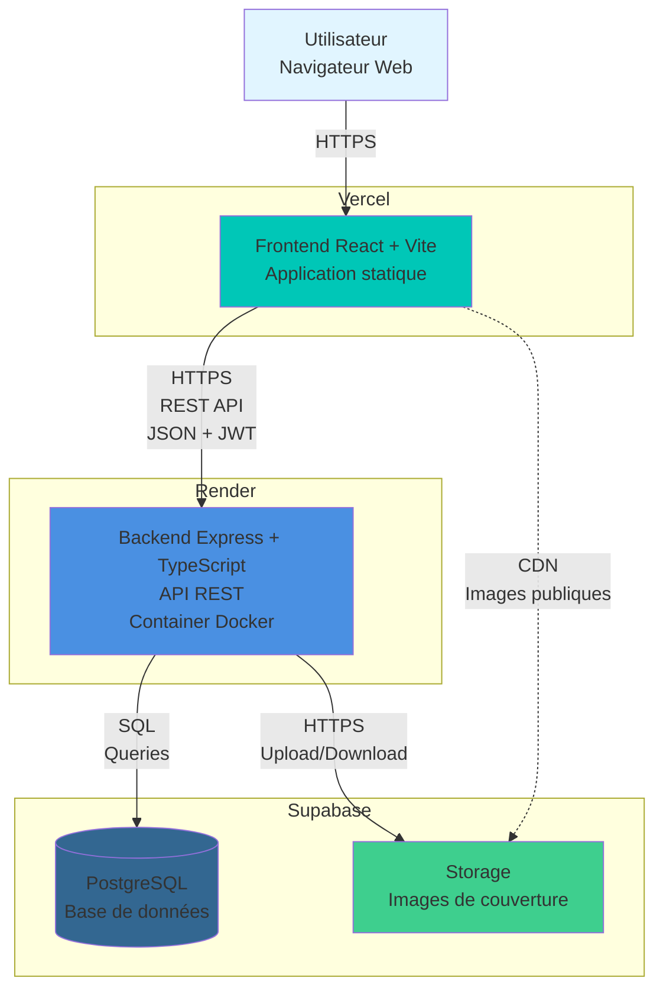

# Architecture Bookish

## Vue d'ensemble

Bookish est une application web full-stack de gestion de bibliothèque personnelle déployée sur une architecture moderne découplée.

## Diagramme d'architecture

## Composants

### Frontend (Vercel)
- **Technologie** : React 18, TypeScript, Vite
- **Hébergement** : Vercel (CDN global)
- **Build** : Application statique (SPA)
- **Déploiement** : Automatique via GitHub (branche main)
- **Variables d'environnement** : `VITE_API_URL`

### Backend (Render)
- **Technologie** : Node.js, Express, TypeScript
- **Hébergement** : Render (Container Docker)
- **Déploiement** : Automatique via GitHub (branche main)
- **Variables d'environnement** : `SUPABASE_URL`, `SUPABASE_KEY`, `JWT_SECRET`, `FRONTEND_URL`
- **Endpoints** :
  - `/api/auth/*` : Authentification (register, login)
  - `/api/books/*` : CRUD livres
  - `/api/reviews/*` : CRUD avis
  - `/api/health` : Health check
  - `/api/metrics` : Métriques de monitoring

### Base de données (Supabase)
- **Technologie** : PostgreSQL (hébergé par Supabase)
- **Tables** :
  - `users` : Utilisateurs avec authentification
  - `books` : Livres avec métadonnées
  - `reviews` : Avis et notes
  - `favorites` : Favoris utilisateurs
- **Sécurité** : Connexion via credentials Supabase

### Stockage (Supabase Storage)
- **Usage** : Images de couverture des livres
- **Bucket** : `book-covers` (permissions publiques)
- **Accès** : Upload via backend, lecture directe par le frontend

## Flux de données

### Authentification
1. L'utilisateur soumet ses credentials via le frontend
2. Le frontend envoie une requête POST à `/api/auth/login`
3. Le backend vérifie les credentials dans PostgreSQL
4. Le backend génère un JWT token et le retourne
5. Le frontend stocke le token (localStorage) et l'inclut dans toutes les requêtes suivantes

### Création d'un livre
1. L'utilisateur remplit le formulaire avec upload d'image
2. Le frontend envoie une requête POST multipart/form-data à `/api/books`
3. Le backend reçoit les données et l'image
4. Le backend upload l'image dans Supabase Storage
5. Le backend insère les métadonnées (dont l'URL de l'image) dans PostgreSQL
6. Le backend retourne le livre créé au frontend

### Consultation de livres
1. Le frontend requête GET `/api/books`
2. Le backend interroge PostgreSQL
3. Le backend retourne la liste des livres avec URLs des couvertures
4. Le frontend affiche les livres et charge les images directement depuis Supabase Storage (CDN)

## Sécurité

- **CORS** : Le backend autorise uniquement l'origine du frontend (configuré via `FRONTEND_URL`)
- **Authentification** : JWT tokens avec expiration de 7 jours
- **Mots de passe** : Hashés avec bcrypt
- **Variables sensibles** : Stockées dans les environnements des plateformes (jamais versionnées)

## Monitoring

Le backend expose un endpoint `/api/metrics` retournant :
- Uptime du process
- Utilisation mémoire (RSS, heap)
- Nombre de requêtes traitées
- Timestamp

Logs structurés avec Morgan (format `combined` en production, `dev` en développement).

## CI/CD

Chaque repository dispose d'une pipeline GitHub Actions :
- Déclenchement sur push/PR vers main
- Installation des dépendances
- Build et vérification de compilation
- Le déploiement sur Vercel/Render se fait automatiquement après merge sur main
